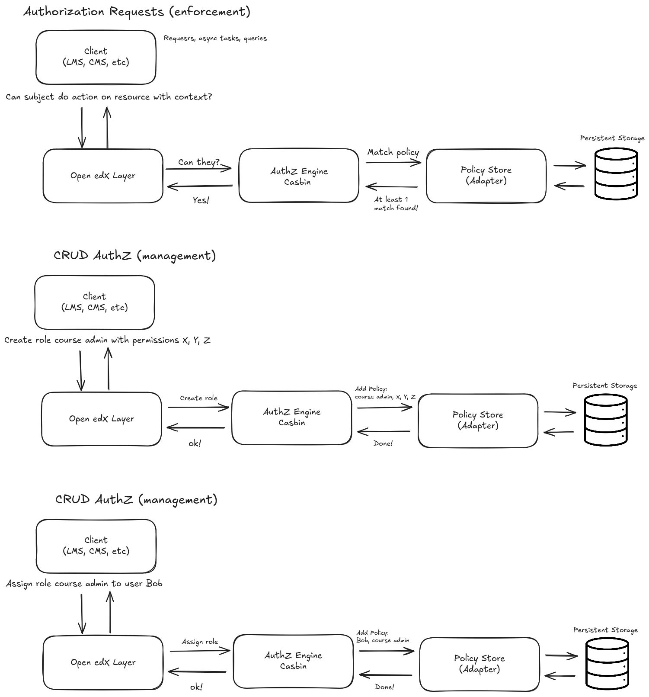

0005: Architecture for Authorization (AuthZ) and Data Modeling
##############################################################

Status
******
**Draft**

Context
*******

The Authorization Model Foundations ADR defines the core principles for authorization in Open edX: normalized Subject-Action-Object-Context checks, explicit scopes, externalized policies, centralized enforcement, and explainability. The Technology Selection ADR established Casbin as the authorization technology to implement these principles, providing the engine on which Open edX will build its authorization internals.

This ADR builds on both by describing how the architecture will be structured on top of Casbin to implement these principles in practice. It defines how authorization internals will be managed centrally and exposed consistently across the Open edX ecosystem, while ensuring services and developers interact only through stable Open edX APIs rather than Casbin internals.

The architecture is guided by the following principles:

- **Separation of Concerns**: Decouple authorization logic from business logic to enhance maintainability and scalability.
- **Centralized Enforcement**: Services do not implement their own authorization logic. All checks flow through a single enforcement path.
- **Stable Interfaces**: Services interact with authorization through stable Open edX APIs, not Casbin internals.
- **Strong contracts**: Define clear contracts for authorization checks, including expected inputs, outputs, and error handling. These should be clear and typed where possible.
- **Policy Externalization**: Policies are managed centrally and can be updated without modifying service code. Policies are managed via a dedicated API.
- **Explainability**: Each decision is traceable to a rule and reproducible under the same state. Tools should be provided to explain decisions.
- **Simplicity**: Keep definitions and interactions as simple and clear as possible to facilitate understanding and adoption.
- **Extensibility and Evolution**: Design for future growth, allowing new actions, subjects, and objects to be added without major overhauls.

Architecture Overview
=====================

The architecture consists of several key components:

- **Authorization (AuthZ) Engine**: The Casbin-based engine that evaluates authorization requests based on defined policies.
- **Policy Store**: A centralized repository for managing authorization policies, which can be implemented using a database or configuration files.
- **Open edX Layer**: The layer where Open edX services and other clients interact with the enforcement API for authorization decisions. This layer abstracts Casbin internals and provides:
  1. **Public API for Authorization Checks**: A well-documented and versioned API that services can use to request authorization decisions.
  2. **REST API for Authorization Checks**: A RESTful interface that allows services to perform authorization checks over HTTP.
  3. **Policy Management Interface**: Tools or interfaces for administrators to manage authorization policies.
  4. **Caching and Performance Optimization**: Mechanisms to optimize performance for frequent authorization checks: caching strategies per decision / per policy.
  5. **Deployment and Configuration**: Support for configuring the authorization engine and policies in different environments.
- **Authorization Clients**: Services or components that request authorization decisions via the enforcement API.

Here is an overview diagram of the architecture:



This architecture is supported by detailed design decisions outlined below.

Decision
********

#. Framework Components and Responsibilities
============================================

Casbin as the Authorization Engine for Open edX
-----------------------------------------------
- Use the Authorization Engine (Casbin) as the core component for evaluating authorization requests based on defined policies.
- The Authorization Engine is responsible for loading policies, evaluating requests, and returning decisions (allow/deny).
- The model configuration (``model.conf``) and policy will be managed centrally as the source of truth for authorization to ensure consistency.

A Dedicated Open edX Layer for Authorization
---------------------------------------------
- Implement an Open edX-specific layer that encapsulates all authorization logic by interacting with the Authorization Engine, ensuring that services interact with a consistent interface.
- The Open edX Layer will provide a stable Enforcement API that abstracts Casbin internals, allowing services to request authorization decisions without needing to understand Casbin specifics.
- Implement a Policy Management API within the Open edX Layer to allow administrators to manage and update authorization policies centrally.
- The Open edX Layer will be implemented as a shared library, a Django app or a Tutor plugin or all three, depending on the what is most suitable. All of these components will be versioned and maintained as part of the Open edX ecosystem as a whole.
- All modifications to the Authorization Engine configuration (model, adapters, etc.) should be done through the Open edX Layer, so no forks of Casbin are needed.

Interact with the Policy Store via the Open edX Layer
------------------------------------------------------
- The policy store, which can be a database or configuration files (e.g., ``authz.policy``) will be accessed and managed through the Open edX Layer. No direct access to the policy store should be made by services.
- The Open edX Layer will handle loading policies from the policy store into the Authorization Engine and ensure that policies are kept up to date.
- The Open edX Layer will also manage the separation between static policies (shipped with services) and dynamic policies (managed via the policy data store) to ensure clarity and maintainability.

Clients Interact Only via the Open edX Layer
--------------------------------------------
- Services and other clients (e.g., MFEs) will interact with the authorization system exclusively through the Open edX Layer's Enforcement API.
- Services will not implement their own authorization logic or interact directly with Casbin internals.
- Services can request authorization decisions by calling the Enforcement API with the necessary context (e.g., user, action, resource) with optional context and receiving a decision (allow/deny) in response.

#. Data & Storage Model
========================

Use a MySQL as the Main Backend for the Policy Store
----------------------------------------------------
- Use MySQL as the main backend for persistent storage for policies (policy store), leveraging Casbin's Django ORM adapter for integration and our own modifications to the adapter as needed in our own ``engine/``` package.
- Use the same schema used by Casbin's Django ORM adapter, which includes a table for storing policies with:
  - ``id``: A unique identifier for each policy. This depends on the database backend. In our case, MySQL uses an auto-incrementing integer.
  - ``ptype``: The policy type (e.g., ``p`` for policy, ``g, g2`` for grouping).
  - ``v0, v1, v2, v3, v4, v5``: The policy fields that define the subject, action, object, and context. The exact meaning of these fields depends on the policy type and model configuration.
- Optionally, include additional metadata fields in the policy table to support auditing and versioning.

Store All Policies in the Policy Store
--------------------------------------
- All policies (i.e., any type of rule) should be stored in the policy store to ensure a single source of truth for authorization.
- Use the policy store to manage RBAC mappings, such as user-role and role-permission assignments, using Casbin's grouping policies (``g, g2``).
- Use Casbin's adapter APIs based on Django APIs to load policies from the policy store into the Authorization Engine at startup and whenever policies are updated.

Maintain Consistent Model and Policy Definitions Across Services
----------------------------------------------------------------
- Policies should be defined in a way that is consistent across services, using the same naming conventions and structures for subjects, actions, objects, and contexts. For example, if the LMS defines a policy for "viewing a course" the CMS should use the same terminology and structure when defining a similar policy for "viewing content".
- Each column in the policy table (v0, v1, v2, etc.) should have a consistent meaning across services. For example, for the same type ``v0`` should always represent the subject, ``v1`` the action, ``v2`` the object, and so on.

#. Client Interactions with the Authorization System
=====================================================

Use the Enforcement API for Authorization Decisions for External Clients
------------------------------------------------------------------------
- External clients (e.g., MFEs, IDAs, or any service not co-located with the policy store) must use the REST API provided by the Open edX authorization layer to request authorization decisions.

Use a Stable and Versioned Public API for Other Clients
-------------------------------------------------------
- The Open edX Layer will provide a stable and versioned Public API for services to interact with the authorization system. This API will be well-documented and include clear contracts for inputs, outputs, and error handling.
- In-process clients (e.g., LMS, CMS, or any service co-located with the policy store) may use this Public API (``api.py``) directly to interact with the Open edX Layer without going through the REST API, but they must still adhere to the same contracts and versioning.
- Clients must provide all necessary context for authorization decisions, including subject, action, object, and any relevant contextual information (e.g., organization, course) and the authorization layer will make the decision based on the policies in the policy store.

Consequences
************

#. **New Components in the Open edX Ecosystem**: There are several new components introduced as part of this architecture:
   - Policy Store: A centralized datastore for storing and managing authorization policies.
   - Enforcement API: An API for enforcing authorization policies and making authorization decisions.
   - Policy Management API: An API for creating, updating, and deleting dynamic policies in the Policy Store.
   - Open edX Layer: The layer that abstracts access to the Policy Store and provides a unified interface for authorization.
   - Authorization Engine: The Casbin-based engine that evaluates authorization requests based on defined policies.

#. **Services Should be Migrated to Use this new Architecture**: Existing services that currently implement their own authorization logic will need to be migrated to use the new architecture. This may involve:
   - Refactoring code to remove direct authorization checks and replace them with calls to the Enforcement API.
   - Defining policies in the ``authz.policy`` file and/or via the Policy Management API.
   - Ensuring that all necessary context is provided when making authorization requests.

#. **The Framework Requires Client Integration**: To make authorization decisions clients must:
   - Call the Open edX Layer's Enforcement API via network with a valid token for authentication and authorization.
   - Install the necessary libraries (e.g., openedx-authz) as dependencies to interact with the Open edX Layer directly if they are in-process clients via the Public API (``api.py``). These libraries should be part of the services's ``INSTALLED_APPS`` -for data migration purposes- and requirements files.

#. **Configuration Files Should be Deployed with Services**: For the framework to function correctly, a couple of configuration files need to be deployed alongside the services:
   - ``model.conf``: This file contains the Casbin model configuration, defining the structure of policies and how they are evaluated. This file is essential for the Authorization Engine to understand how to process authorization requests. By default, all services share the same ``model.conf`` to ensure consistency in authorization logic across the platform.
   - ``authz.policy``: This file contains the default policies for the service. If no policy store is configured, the service will not have any policies so no authorization decisions can be properly made.

#. **Use of MySQL for Policy Storage**: The choice of MySQL as the backend for the policy store means that all policies will be stored in a relational database, which may have implications for performance and scalability. However, this also allows us to leverage existing database infrastructure and tools for managing and querying policies. If support for other databases is needed in the future, we can explore using other Casbin adapters.

#. **Roles and Permissions are Stored in the Policy Store**: All roles and permissions will be managed through the policy store, which means that any changes to roles or permissions will need to be made via the Policy Management API or by updating the ``authz.policy`` file. This centralization simplifies management but requires careful handling to avoid conflicts or inconsistencies.

#. **The Policy Storage Table is Not Friendly to Manual Management**: The policy storage table is designed to be managed programmatically via the Policy Management API and the Open edX Layer. Direct manual edits to the table are discouraged, as they may lead to inconsistencies or errors in policy evaluation. Instead, all changes to policies should be made through the provided APIs.

#. **Default Policies and Model Configurations Can be Shared with Stakeholders**: The ``model.conf`` and ``authz.policy`` files can be shared with stakeholders (e.g., operators or administrators) to provide transparency into the authorization logic and policies being enforced. This can help build trust and ensure that policies align with organizational goals and compliance requirements.

#. **Abstraction Although Reduces Cognitive Load, It Also Adds Complexity**: By abstracting access to the Policy Store and authorization logic through the Open edX Layer, we reduce the cognitive load on service developers who no longer need to understand Casbin internals. However, this abstraction also adds a layer of complexity to the system, as services must now interact with the Open edX Layer rather than directly with the Authorization Engine. This trade-off is justified by the benefits of consistency, maintainability, and ease of use.
