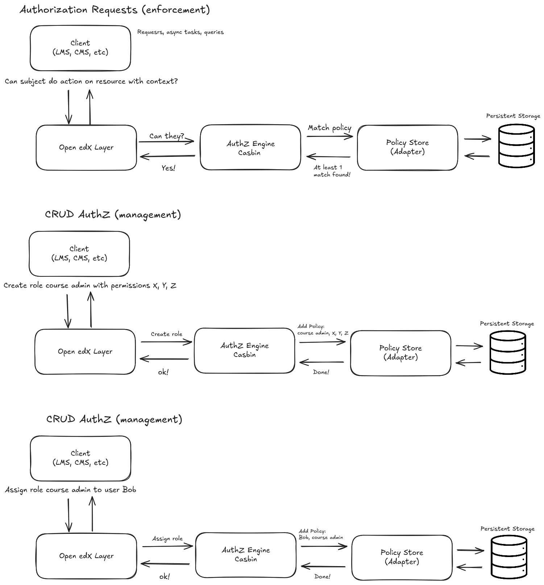

0005: Architecture for Authorization (AuthZ) and Data Modeling
##############################################################

Status
******
**Draft**

Context
*******

The Authorization Model Foundations ADR defines the core principles for authorization in Open edX: normalized Subject-Action-Object-Context checks, explicit scopes, externalized policies, centralized enforcement, and explainability. The Technology Selection ADR established Casbin as the authorization technology to implement these principles, providing the engine on which Open edX will build its authorization internals.

This ADR builds on both by describing how the architecture is structured on top of Casbin to implement these principles in practice. It defines how authorization internals are managed centrally and exposed consistently across the Open edX ecosystem, while ensuring services and developers interact only through stable Open edX APIs rather than Casbin internals.

The architecture is guided by the following principles:

- **Separation of Concerns**: Decouple authorization logic from business logic to enhance maintainability and scalability.
- **Centralized Enforcement**: Services do not implement their own authorization logic. All checks flow through a single enforcement path.
- **Stable Interfaces**: Services interact with authorization through stable Open edX APIs, not Casbin internals.
- **Strong contracts**: Define clear contracts for authorization checks, including expected inputs, outputs, and error handling. These should be clear and typed where possible.
- **Policy Externalization**: Policies are managed centrally and can be updated without modifying service code. Policies are managed via a dedicated API.
- **Explainability**: Each decision is traceable to a rule and reproducible under the same state. Tools should be provided to explain decisions.
- **Simplicity**: Keep definitions and interactions as simple and clear as possible to facilitate understanding and adoption.
- **Extensibility and Evolution**: Design for future growth, allowing new actions, subjects, and objects to be added without major overhauls.

Architecture Overview
=====================

The architecture consists of several key components:

- **Authorization (AuthZ) Engine**: The Casbin-based engine that evaluates authorization requests based on defined policies.
- **Policy Store**: The database (via Django ORM) where all authorization policies are persisted. The policy store holds two categories of policies:

  1. **Static policies**: Shipped with services as default role-permission definitions (e.g., the built-in permissions for ``library_admin`` or ``course_staff``). These are loaded into the policy store via management commands (``load_policies``) or data migrations and are not meant to be edited by operators.
  2. **Dynamic policies**: Created at runtime through the Policy Management API or Django Admin. These include role assignments (granting a user a role in a scope) and any operator-defined policy additions.

  Both categories are stored in the same ``CasbinRule`` table and are loaded into the engine uniformly. The distinction is organizational, not structural.

- **Open edX Layer**: The layer where Open edX services and other clients interact with the enforcement API for authorization decisions. This layer abstracts Casbin internals and provides:

  1. **Public Python API for Authorization Checks**: A well-documented and versioned API (``openedx_authz.api``) that in-process services can use to request authorization decisions, manage roles, and query permissions. The API is organized into three modules: ``permissions`` (enforcement checks), ``roles`` (role and assignment management), and ``users`` (user-oriented convenience wrappers).
  2. **REST API for Authorization Checks**: A RESTful interface for remote clients (MFEs, IDAs) to perform authorization checks over HTTP. See `ADR 0007`_ for the API definition.
  3. **Policy Management Interface**: Tools for administrators to manage authorization policies, including management commands (``load_policies``, ``enforcement``, migration commands) and Django Admin integration.
  4. **Caching and Performance Optimization**: A ``PolicyCacheControl`` model tracks a version UUID that the enforcer compares on each request. Policy changes increment the version, triggering a reload only when needed. The ``SyncedEnforcer`` also supports configurable auto-load intervals for periodic refresh.
  5. **Deployment and Configuration**: Support for configuring the authorization engine and policies in different environments via Django settings (``CASBIN_MODEL``, ``CASBIN_DB_ALIAS``, ``CASBIN_AUTO_LOAD_POLICY_INTERVAL``, ``CASBIN_AUTO_SAVE_POLICY``).

- **Authorization Clients**: Services or components that request authorization decisions via the enforcement API.

Here is an overview diagram of the architecture:

This architecture is supported by detailed design decisions outlined below.

Decision
********

#. Framework Components and Responsibilities
============================================

Casbin as the Authorization Engine for Open edX
-----------------------------------------------
- Use the Authorization Engine (Casbin) as the core component for evaluating authorization requests based on defined policies.
- The Authorization Engine is responsible for loading policies, evaluating requests, and returning decisions (allow/deny).
- The model configuration (``model.conf``) and policy will be managed centrally as the source of truth for authorization to ensure consistency.
- The enforcer is implemented as a singleton (``AuthzEnforcer``) wrapping Casbin's ``SyncedEnforcer``, with an ``ExtendedAdapter`` for database-backed policy storage and filtered loading.
- Custom matcher functions (e.g., ``is_staff_or_superuser``) are registered on the enforcer to handle platform-specific authorization shortcuts without modifying the Casbin model language.

A Dedicated Open edX Layer for Authorization
---------------------------------------------
- Implement an Open edX-specific layer that encapsulates all authorization logic by interacting with the Authorization Engine, ensuring that services interact with a consistent interface.
- The Open edX Layer provides a stable Enforcement API that abstracts Casbin internals, allowing services to request authorization decisions without needing to understand Casbin specifics.
- Implement a Policy Management API within the Open edX Layer to allow administrators to manage and update authorization policies centrally.
- The Open edX Layer is implemented as a Django app (``openedx_authz``) installable as a pip dependency. It registers as both an LMS and CMS plugin via ``entry_points`` for automatic discovery. It may also serve as a shared library for other services.
- All modifications to the Authorization Engine configuration (model, adapters, etc.) are done through the Open edX Layer, so no forks of Casbin are needed.

Interact with the Policy Store via the Open edX Layer
------------------------------------------------------
- The policy store (the database, accessed through Django ORM) is managed through the Open edX Layer. No direct access to the policy store should be made by services.
- The Open edX Layer handles loading policies from the policy store into the Authorization Engine and ensures that policies are kept up to date. Dynamic policies are reloaded when the ``PolicyCacheControl`` version changes (triggered by API write operations or management commands). Static policies are loaded via ``load_policies`` at deployment time and through data migrations.
- The Open edX Layer manages the separation between static policies (shipped with services as default role-permission definitions in ``constants/``) and dynamic policies (created at runtime via the API). Static policies define what roles can do; dynamic policies assign users to those roles in specific scopes.

Clients Interact Only via the Open edX Layer
--------------------------------------------
- Services and other clients (e.g., MFEs) interact with the authorization system exclusively through the Open edX Layer's APIs.
- Services do not implement their own authorization logic or interact directly with Casbin internals.
- Services can request authorization decisions by calling the Enforcement API with the necessary context (subject, action, scope) and receiving a decision (allow/deny) in response.

#. Authorization Model Configuration
======================================

Request Format
--------------
Authorization requests use a three-field format:

.. code:: text

   r = sub, act, scope

Where:

- **sub** (subject): The entity requesting access, namespaced (e.g., ``user^alice``, ``service^lms``).
- **act** (action): The operation being requested, namespaced (e.g., ``act^content_libraries.view_library``).
- **scope**: The authorization context, namespaced (e.g., ``lib^lib:DemoX:CSPROB``, ``course-v1^course-v1:Org+Course+Run``, ``*`` for global).

The S-A-O-C model from the Foundations ADR maps into this format by combining Object and Context into **scope**. In practice, the scope identifies both what resource is being accessed and the boundary within which the permission applies. This simplification works because Open edX authorization decisions are always scoped to a specific resource or a global wildcard.

Policy Format
-------------
Policies link roles to actions within scopes with an effect:

.. code:: text

   p = sub, act, scope, eft

Where ``sub`` is typically a role (e.g., ``role^library_admin``), ``act`` is an action, ``scope`` is a scope pattern (e.g., ``lib^*`` for all libraries), and ``eft`` is ``allow`` or ``deny``. Deny overrides allow.

Role Definitions
----------------
Two grouping policies support role assignments and action grouping:

- **g** (role assignments with scope): ``g = _, _, _`` — links a subject to a role within a scope (e.g., ``g, user^alice, role^library_admin, lib^lib:DemoX:CSPROB``). Also supports role hierarchy (e.g., ``g, role^org_admin, role^org_editor, org^OpenedX``).
- **g2** (action grouping): ``g2 = _, _`` — maps high-level actions to specific actions to reduce policy duplication (e.g., ``g2, act^manage, act^edit`` means "manage" implies "edit").

Namespace Convention
--------------------
All policy attributes use a ``^`` separator between the namespace prefix and the identifier:

- Subjects: ``user^alice``, ``service^lms``
- Roles: ``role^library_admin``, ``role^course_staff``
- Actions: ``act^content_libraries.view_library``
- Scopes: ``lib^lib:DemoX:CSPROB``, ``course-v1^course-v1:Org+Course+Run``, ``global^*``

External keys (e.g., ``course-v1:Org+Course+Run``, ``lib:DemoX:CSPROB``) retain their original ``:`` separator. This distinction prevents ambiguity between the authz namespace and the resource identifier.

The namespace convention enables polymorphic dispatch: the system can determine the correct data class or model subclass from a namespaced key alone (e.g., ``lib^...`` resolves to ``ContentLibraryData`` / ``ContentLibraryScope``).

Matcher Logic
-------------
The matcher evaluates all conditions for a policy to match:

1. **Subject** must have the role in the requested scope OR a global role (``*``), OR match a platform-level shortcut (``is_staff_or_superuser``).
2. **Scope** must match the policy pattern (using ``keyMatch`` for wildcard support).
3. **Action** must match exactly OR be implied via action grouping (``g2``).

.. note::

   Changing the ``model.conf`` changes the meaning of stored policy data. If the model definition changes (e.g., reordering fields, changing matchers), existing dynamic policies in the database may need to be rebuilt or migrated. Static policies (loaded from ``constants/``) are regenerated on deployment and are safe. Model changes should be treated as high-risk migrations.

#. Data & Storage Model
========================

Use the Django ORM for the Policy Store
----------------------------------------
- Use the Django ORM as the backend for persistent policy storage, leveraging Casbin's Django ORM adapter (``casbin-django-orm-adapter``) and our own ``ExtendedAdapter`` for filtered loading. See the `Casbin Django ORM Adapter documentation`_ for details on the base adapter.
- The policy store uses the same database as the host service (LMS or CMS). Since both LMS and CMS share the same MySQL/PostgreSQL database in standard deployments, policies are effectively shared. The ``openedx_authz`` app is installed in both LMS and CMS via entry points, so both services have access to the same policy data.
- Use the schema provided by Casbin's Django ORM adapter (the ``CasbinRule`` table):

  - ``id``: Auto-incrementing integer primary key.
  - ``ptype``: The policy type (``p`` for permission policies, ``g`` for role assignments, ``g2`` for action groupings).
  - ``v0, v1, v2, v3, v4, v5``: The policy fields. Their meaning depends on ``ptype``:

    - For ``p``: ``v0`` = role, ``v1`` = action, ``v2`` = scope, ``v3`` = effect.
    - For ``g``: ``v0`` = subject, ``v1`` = role, ``v2`` = scope.
    - For ``g2``: ``v0`` = parent action, ``v1`` = child action.

- An ``ExtendedCasbinRule`` model extends each ``CasbinRule`` with additional metadata:

  - ``casbin_rule_key``: Unique composite key (``ptype,v0,v1,v2,v3``) for lookup.
  - ``casbin_rule``: OneToOne link to the ``CasbinRule``.
  - ``description``, ``created_at``, ``updated_at``, ``metadata`` (JSON): Audit and versioning fields.
  - ``scope``: ForeignKey to a ``Scope`` model instance (for cascading deletes when resources are removed).
  - ``subject``: ForeignKey to a ``Subject`` model instance (for cascading deletes when users are removed).

  These metadata fields are non-optional for role assignments created through the API. They support auditing, resource lifecycle management, and querying assignments by scope or subject without parsing Casbin's generic ``v0-v5`` fields.

- A ``PolicyCacheControl`` singleton model stores a UUID version. The enforcer compares this version on each request and reloads policies only when the version has changed. Write operations through the API increment the version automatically.

Store All Policies in the Policy Store
--------------------------------------
- All policies (any type of rule) are stored in the policy store to ensure a single source of truth for authorization.
- Use the policy store to manage RBAC mappings, such as user-role and role-permission assignments, using Casbin's grouping policies (``g``, ``g2``).
- Use Casbin's adapter APIs based on Django APIs to load policies from the policy store into the Authorization Engine at startup and whenever dynamic policies are updated through the API.

Scope and Subject Polymorphism
------------------------------
- **Scope** is modeled as a polymorphic base class (``Scope``) with concrete subclasses for each resource type:

  - ``ContentLibraryScope`` (namespace ``lib``): Links to the ``ContentLibrary`` model via FK for cascading deletes.
  - ``CourseScope`` (namespace ``course-v1``): Links to the ``CourseOverview`` model via FK for cascading deletes.
  - New scope types can be added by subclassing ``Scope``, setting a ``NAMESPACE``, and implementing ``get_or_create_for_external_key()``. The base class uses a registry pattern (``__init_subclass__``) for automatic discovery.

- **Subject** follows the same polymorphic pattern:

  - ``UserSubject`` (namespace ``user``): Links to the ``User`` model via FK for cascading deletes.
  - New subject types (e.g., services, groups) can be added by subclassing ``Subject``.

- At the data layer, ``ScopeData`` and ``SubjectData`` use metaclass-based registries for polymorphic instantiation from namespaced keys (e.g., ``ScopeData(namespaced_key='lib^lib:DemoX:CSPROB')`` returns a ``ContentLibraryData`` instance).

Maintain Consistent Model and Policy Definitions Across Services
----------------------------------------------------------------
- Policies are defined consistently across services, using the same naming conventions and structures for subjects, actions, objects, and contexts. For example, if the LMS defines a policy for "viewing a course" the CMS uses the same terminology and structure.
- Each column in the policy table (``v0``, ``v1``, ``v2``, etc.) has a consistent meaning for each policy type, as defined in the model configuration above.
- The namespace convention (``^`` separator) ensures that policy attributes from different domains cannot collide.

Cross-Service Policy Isolation
------------------------------
- The ``CasbinRule`` table does not include a service-origin field. Any service with database access can read and write policies for any scope.
- Isolation is enforced at the API level: the Public API functions operate on typed data objects (``ScopeData``, ``RoleData``) that constrain operations to well-defined scopes. Direct database access is discouraged.
- Future work may introduce policy ownership metadata or namespace-based write restrictions if cross-service policy conflicts become a concern.

#. Client Interactions with the Authorization System
=====================================================

Use the REST API for External Clients
--------------------------------------
- External clients (e.g., MFEs, IDAs, or any service not co-located with the policy store) must use the REST API provided by the Open edX authorization layer to request authorization decisions. See `ADR 0007`_ for the REST API definition.

Use a Stable and Versioned Public API for In-Process Clients
------------------------------------------------------------
- The Open edX Layer provides a stable Public Python API for services co-located with the policy store (LMS, CMS). The API is organized as:

  - ``openedx_authz.api.permissions``: Enforcement checks (``is_subject_allowed``), permission queries.
  - ``openedx_authz.api.roles``: Role definitions, role assignment/unassignment, role queries.
  - ``openedx_authz.api.users``: User-oriented convenience wrappers (``is_user_allowed``, ``assign_role_to_user_in_scope``, etc.) that accept plain strings instead of data objects.

- The ``users`` module provides the primary public interface for most callers, accepting plain external keys (usernames, role names, scope identifiers) and handling namespacing internally.
- Clients must provide all necessary context for authorization decisions: subject, action, and scope. The authorization layer makes the decision based on the policies in the policy store.

Consequences
************

#. **New Components in the Open edX Ecosystem**: There are several new components introduced as part of this architecture:
   - Policy Store: The database tables (``CasbinRule``, ``ExtendedCasbinRule``, ``PolicyCacheControl``, ``Scope`` subclasses, ``Subject`` subclasses) managed through the Django ORM.
   - Enforcement API: The Public Python API and REST API for enforcing authorization policies and making authorization decisions.
   - Policy Management API: Functions for creating, updating, and deleting dynamic policies in the Policy Store.
   - Open edX Layer: The ``openedx_authz`` Django app that abstracts access to the Policy Store and provides a unified interface for authorization.
   - Authorization Engine: The Casbin-based ``AuthzEnforcer`` singleton that evaluates authorization requests based on defined policies.

#. **Services Should be Migrated to Use this new Architecture**: Existing services that currently implement their own authorization logic will need to be migrated to use the new architecture. See `ADR 0008`_ for the compatibility scheme and `ADR 0009`_ for the course authoring migration plan. Migration involves:
   - Refactoring code to remove direct authorization checks and replace them with calls to the Enforcement API.
   - Defining role-permission mappings in ``constants/`` and loading them via management commands or data migrations.
   - Ensuring that all necessary context is provided when making authorization requests.
   - Feature flags control the cutover per scope (see `ADR 0010`_). Migration scripts handle bidirectional data migration (see `ADR 0011`_).

#. **The Framework Requires Client Integration**: To make authorization decisions clients must:
   - Call the Open edX Layer's REST API with a valid token for authentication (external clients). See `ADR 0007`_.
   - Install ``openedx-authz`` as a dependency and include it in ``INSTALLED_APPS`` (in-process clients). The library handles data migrations and model registration automatically.

#. **Configuration Files Should be Deployed with Services**: The ``model.conf`` file (shipped inside the ``openedx_authz`` package at ``engine/config/model.conf``) contains the Casbin model configuration. By default, all services share the same ``model.conf`` to ensure consistency. The ``CASBIN_MODEL`` setting points to this file.

#. **Database Backend for Policy Storage**: The policy store uses the Django ORM, which supports both MySQL and PostgreSQL. In standard Open edX deployments, this is the same database used by LMS and CMS. The choice of a shared database means policies are immediately visible to both services without synchronization. If support for separate databases is needed, the ``CASBIN_DB_ALIAS`` setting allows pointing to a different database.

#. **Roles and Permissions are Stored in the Policy Store**: All roles and permissions are managed through the policy store. Default role-permission definitions are maintained in ``openedx_authz.constants`` (``roles.py``, ``permissions.py``) and loaded into the policy store at deployment time. Changes to role definitions require redeployment and re-running the policy loading step.

   .. note::

      Role and permission definitions are currently hardcoded in ``constants/``. This is acknowledged as technical debt — the long-term goal is to externalize these definitions so third-party modules can register their own roles and permissions without modifying the ``openedx-authz`` repository. See `ADR 0009`_ for context.

#. **The Policy Storage Table is Not Friendly to Manual Management**: The ``CasbinRule`` table uses generic field names (``v0``-``v5``) whose meaning depends on the ``ptype``. Direct manual edits are discouraged. The ``ExtendedCasbinRule`` provides human-readable metadata and typed foreign keys for querying. All changes should be made through the provided APIs or management commands.

#. **Default Policies and Model Configurations Can be Shared with Stakeholders**: The ``model.conf`` and default role-permission definitions in ``constants/`` can be shared with stakeholders to provide transparency into the authorization logic being enforced.

#. **Abstraction Reduces Cognitive Load but Adds Complexity**: By abstracting access to the Policy Store and authorization logic through the Open edX Layer, we reduce the cognitive load on service developers who no longer need to understand Casbin internals. However, this abstraction adds a layer of complexity to the system, as services must now interact with the Open edX Layer rather than directly with the Authorization Engine. This trade-off is justified by the benefits of consistency, maintainability, and ease of use.

#. **Legacy Compatibility During Migration**: During the transition period, legacy compatibility permissions (e.g., ``courses.legacy_instructor_role_permissions``) allow new AuthZ roles to carry equivalent legacy permissions. This enables gradual migration without breaking existing code paths that haven't been updated yet. See `ADR 0008`_ for the compatibility scheme.

References
**********

- `Authorization Model Foundations ADR`_
- `Technology Selection ADR`_
- `ADR 0007`_
- `ADR 0008`_
- `ADR 0009`_
- `ADR 0010`_
- `ADR 0011`_
- `Casbin Django ORM Adapter documentation`_

.. _Authorization Model Foundations ADR: https://github.com/openedx/openedx-authz/blob/main/docs/decisions/0002-authorization-model-foundation.rst

.. _Technology Selection ADR: https://github.com/openedx/openedx-authz/blob/main/docs/decisions/0004-technology-selection.rst

.. _ADR 0007: https://github.com/openedx/openedx-authz/blob/main/docs/decisions/0007-enforcement-mechanisms-mfe.rst

.. _ADR 0008: https://github.com/openedx/openedx-authz/blob/main/docs/decisions/0008-compatibility-scheme.rst

.. _ADR 0009: https://github.com/openedx/openedx-authz/blob/main/docs/decisions/0009-authz-for-course-authoring.rst

.. _ADR 0010: https://github.com/openedx/openedx-authz/blob/main/docs/decisions/0010-course-authoring-flag.rst

.. _ADR 0011: https://github.com/openedx/openedx-authz/blob/main/docs/decisions/0011-course-authoring-migration-process.rst

.. _Casbin Django ORM Adapter documentation: https://github.com/pycasbin/django-orm-adapter
